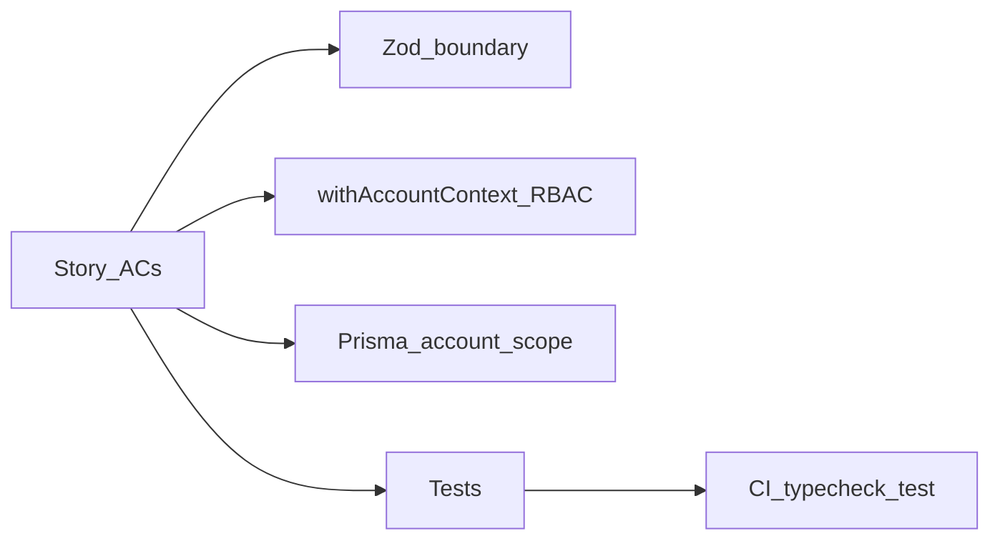

# Capturely — User stories (Epics 1–4 intent)

This document translates the **themes** of an external “AutoForm-style” Phase 1 backlog (foundation → config/AI → publish/experiments → runtime/events/privacy) into **Capturely-specific** user stories. It does **not** prescribe Supabase, Edge KV, 14 micro-signals, or Thompson sampling—see [Non-goals vs external backlog](#non-goals-vs-external-autoform-style-backlog).

**Engineering rules:** [cursorrule](../cursorrule) §0–12 and Capturely [CLAUDE.md](../CLAUDE.md). **Architecture:** [prisma/schema.prisma](../prisma/schema.prisma).

**Compliance pattern (every story):** API inputs validated (Zod where applicable); `withAccountContext()` + RBAC; tenant isolation via `accountId`; structured errors `{ error, code }`; tests (happy path + failure path); `npm run typecheck` and `npm test` green; migrations expand-first when schema changes; no secrets in logs.

---

## Definition of Done (cursorrule §9)

Before a PR for a story is ready:

- [ ] Scope matches the story (no extras).
- [ ] Tests added/updated for new behavior; regression test for bugfixes.
- [ ] Lint/typecheck pass locally; CI green.
- [ ] No secrets in code or logs.
- [ ] Backward compatibility preserved, or migration + runbook included.
- [ ] Error handling and logs include useful, non-PII context.
- [ ] Docs updated if user-visible behavior or API contract changes.

---

## Group 1 — Foundation (Epic 1 intent)

### CAP-01 — Account provisioning and protected app

| | |
|--|--|
| **As a** | new user |
| **I want** | an account and membership created on first sign-in |
| **So that** | I can access `/app` and tenant-scoped data |

**Functional acceptance criteria**

- [ ] First successful Clerk session triggers `ensureAccountForUser` (or equivalent) idempotently.
- [ ] User receives an `AccountMember` row with appropriate role (e.g. owner for first user).
- [ ] Unauthenticated requests to protected `/app` routes redirect or 401 per [src/middleware.ts](../src/middleware.ts).

**cursorrule acceptance criteria**

- [ ] No cross-tenant reads/writes; account resolution is deterministic on retry.
- [ ] Tests or integration coverage for “new user” vs “returning user” where feasible without brittle Clerk mocks.

**Code pointers:** [src/lib/account.ts](../src/lib/account.ts), [src/middleware.ts](../src/middleware.ts)

---

### CAP-02 — Dashboard shell and navigation

| | |
|--|--|
| **As a** | logged-in user |
| **I want** | a consistent dashboard layout and navigation |
| **So that** | I can reach campaigns, sites, settings, and analytics |

**Functional acceptance criteria**

- [ ] [src/app/app/layout.tsx](../src/app/app/layout.tsx) provides header, nav, and main content region.
- [ ] Protected routes render only for authenticated users (Clerk).

**cursorrule acceptance criteria**

- [ ] No secrets or server-only keys in client bundles for layout-only changes.

**Code pointers:** [src/app/app/layout.tsx](../src/app/app/layout.tsx)

---

### CAP-03 — Plan limits on resource usage

| | |
|--|--|
| **As a** | account owner |
| **I want** | plan limits enforced on sites, campaigns, submissions, and AI usage |
| **So that** | usage matches subscription and abuse is limited |

**Functional acceptance criteria**

- [ ] Creating sites, campaigns, or AI generations respects [src/lib/plans.ts](../src/lib/plans.ts) and `AccountUsage` (submission count, AI generations, etc.).
- [ ] Appropriate HTTP responses when locked (e.g. 402/403 per product rules); runtime submit may remain allowed per PRD where specified.

**cursorrule acceptance criteria**

- [ ] Enforcement on **server** for every mutating API; no client-only limits for security-sensitive caps.
- [ ] Tests for at-limit and under-limit behavior where logic is non-trivial.

**Code pointers:** [src/lib/plans.ts](../src/lib/plans.ts), `AccountUsage` in [prisma/schema.prisma](../prisma/schema.prisma)

---

## Group 2 — Config, renderer, AI (Epic 2 intent)

### CAP-04 — Shared form schema and validation

| | |
|--|--|
| **As a** | developer |
| **I want** | one shared definition of form structure and validation |
| **So that** | the widget and server never disagree |

**Functional acceptance criteria**

- [ ] [packages/shared/forms](../packages/shared/forms) exposes types and validators used by widget bundle and server.
- [ ] Submissions are validated with the same rules as preview/runtime.

**cursorrule acceptance criteria**

- [ ] Changes to shared types include tests in shared package or consuming routes.
- [ ] No duplicate validation logic in dashboard-only code paths without justification.

**Code pointers:** [packages/shared/forms](../packages/shared/forms), [src/lib/embed-utils.ts](../src/lib/embed-utils.ts) (if snippet-related)

---

### CAP-05 — Builder persists campaign and variant config

| | |
|--|--|
| **As a** | marketer |
| **I want** | the builder to save campaign and variant JSON reliably |
| **So that** | I do not lose work |

**Functional acceptance criteria**

- [ ] PATCH campaign and variant endpoints persist `targetingJson`, `triggerJson`, `schemaJson`, etc., per [Campaign](../prisma/schema.prisma) / [Variant](../prisma/schema.prisma).
- [ ] Responses do not leak other accounts’ data.

**cursorrule acceptance criteria**

- [ ] Zod (or strict validation) on PATCH bodies; 400 with `code` on invalid input.
- [ ] `withAccountContext` + `canManageCampaigns` (or stricter) on mutations; tests for 403.

**Code pointers:** [src/app/api/campaigns](../src/app/api/campaigns) (`[id]/`, `variants` routes)

---

### CAP-06 — AI-assisted form generation (server-only)

| | |
|--|--|
| **As a** | marketer |
| **I want** | to generate a draft form from a prompt |
| **So that** | I can start faster |

**Functional acceptance criteria**

- [ ] [src/app/api/ai/generate/route.ts](../src/app/api/ai/generate/route.ts) (and related routes) run **server-side only**; API keys never exposed to the client.
- [ ] Generated output is validated against shared schema before persistence; invalid output rejected or repaired per product rules.
- [ ] AI usage increments `AccountUsage.aiGenerationsCount` and respects plan limits.

**cursorrule acceptance criteria**

- [ ] Rate limiting / plan checks documented and tested where implemented.
- [ ] No raw prompt or PII in application logs.

**Code pointers:** [src/app/api/ai](../src/app/api/ai), [src/lib/ai](../src/lib/ai)

---

## Group 3 — Publish and experiments (Epic 3 intent)

### CAP-07 — Publish updates manifest for the widget

| | |
|--|--|
| **As a** | merchant |
| **I want** | Publish to refresh what the widget loads |
| **So that** | visitors see the latest campaign |

**Functional acceptance criteria**

- [ ] POST `src/app/api/campaigns/[id]/publish/route.ts` builds and writes manifest via [src/lib/manifest.ts](../src/lib/manifest.ts) (or equivalent).
- [ ] `hasUnpublishedChanges` and status flags reflect product rules after publish.

**cursorrule acceptance criteria**

- [ ] Publish is safe to retry or documented idempotent behavior; no secrets in manifest JSON.
- [ ] Tests or scripted checks for manifest shape where practical.

**Code pointers:** [src/app/api/campaigns](../src/app/api/campaigns) (publish under `[id]/publish`), [src/lib/manifest.ts](../src/lib/manifest.ts)

---

### CAP-08 — Optimization and variant lifecycle

| | |
|--|--|
| **As a** | product owner |
| **I want** | optimization state (`OptimizationStatus`, auto-optimize) to stay consistent |
| **So that** | experiments and cron jobs do not corrupt campaigns |

**Functional acceptance criteria**

- [ ] Transitions on `Campaign.optimizationStatus` and related models follow documented rules (idle → generating → experimenting → promoting, etc.).
- [ ] Cron or webhooks (e.g. GrowthBook) update variants and flags coherently.

**cursorrule acceptance criteria**

- [ ] Multi-step writes use Prisma transactions where multiple rows must stay consistent.
- [ ] Cron routes protected with shared secret; no anonymous triggers.

**Code pointers:** [src/app/api/cron](../src/app/api/cron), [prisma/schema.prisma](../prisma/schema.prisma) (`OptimizationRun`, `Campaign`)

---

## Group 4 — Runtime, events, submissions, privacy (Epic 4 intent)

### CAP-09 — Runtime token and idempotent submit

| | |
|--|--|
| **As a** | site visitor |
| **I want** | my submission to succeed once even if the network retries |
| **So that** | I am not duplicated |

**Functional acceptance criteria**

- [ ] POST `/api/runtime/token` returns short-lived JWT; POST `/api/runtime/submit` validates JWT and payload.
- [ ] Duplicate `(site_id, submission_id)` does not create a second row; behavior is documented.

**cursorrule acceptance criteria**

- [ ] Validation on submit body; structured errors; CORS limited to product requirements.
- [ ] Tests for idempotency and invalid token.

**Code pointers:** [src/app/api/runtime](../src/app/api/runtime), [prisma/schema.prisma](../prisma/schema.prisma) (`Submission`)

---

### CAP-10 — Experiment events for analytics

| | |
|--|--|
| **As a** | merchant |
| **I want** | impressions and conversions recorded per campaign/variant |
| **So that** | dashboard analytics are accurate |

**Functional acceptance criteria**

- [ ] `ExperimentEvent` rows align with [src/app/api/analytics](../src/app/api/analytics) aggregations (campaign-scoped, time-windowed).
- [ ] Widget or server emits events consistent with schema (`eventType`, `variationId`, etc.).

**cursorrule acceptance criteria**

- [ ] Ingest paths validate input; reject malformed events without corrupting DB.
- [ ] Tests for tenant isolation on analytics GET routes.

**Code pointers:** [prisma/schema.prisma](../prisma/schema.prisma) (`ExperimentEvent`), [src/app/api/analytics/overview/route.ts](../src/app/api/analytics/overview/route.ts), `src/app/api/campaigns/[id]/analytics/route.ts`

---

### CAP-11 — Webhooks and integrations

| | |
|--|--|
| **As a** | merchant |
| **I want** | submissions forwarded to my endpoints (Zapier / custom webhooks) |
| **So that** | I can automate downstream workflows |

**Functional acceptance criteria**

- [ ] Site-scoped webhooks in [Webhook](../prisma/schema.prisma) model; CRUD under [src/app/api/webhooks](../src/app/api/webhooks) with tenant checks.
- [ ] Optional campaign `webhookUrl` or product-defined dispatch path behaves as documented.

**cursorrule acceptance criteria**

- [ ] Secrets for signing outbound webhooks stay server-side; retries idempotent where implemented.
- [ ] Tests for 403 on wrong `siteId` / `accountId`.

**Code pointers:** [src/app/api/webhooks](../src/app/api/webhooks), [src/app/api/integrations](../src/app/api/integrations)

---

### CAP-12 — Data deletion and privacy (incremental)

| | |
|--|--|
| **As a** | account owner |
| **I want** | a clear story for deleting or exporting data |
| **So that** | we meet privacy expectations |

**Functional acceptance criteria**

- [ ] Document current behavior: what happens on account/campaign/site deletion, submission retention, and exports (align with [docs/PRD.md](./PRD.md) and implementation).
- [ ] Backlog explicit gaps vs a full “hard delete all PII with anonymized aggregates” matrix (external Epic 3.6-style) if not implemented.

**cursorrule acceptance criteria**

- [ ] Any new deletion API: Zod + RBAC + transactional deletes; no orphan PII without intent.
- [ ] No deletion of production data in unit tests; use test DB or mocks.

**Code pointers:** [prisma/schema.prisma](../prisma/schema.prisma), account/campaign delete routes if present

---

### CAP-13 — Sites and API keys

| | |
|--|--|
| **As an** | admin |
| **I want** | to create sites and rotate keys |
| **So that** | embed and runtime are scoped correctly |

**Functional acceptance criteria**

- [ ] [src/app/api/sites](../src/app/api/sites) CRUD with `accountId` scope; public/secret keys generated per [src/lib/keys.ts](../src/lib/keys.ts) patterns.
- [ ] Members vs admins see appropriate fields (e.g. secret key only for managers).

**cursorrule acceptance criteria**

- [ ] Tests for role-based field visibility and cross-account 403.

**Code pointers:** [src/app/api/sites](../src/app/api/sites), [src/lib/rbac.ts](../src/lib/rbac.ts)

---

## Non-goals vs external (AutoForm-style) backlog

The following are **out of scope** for this Capturely story set unless added in a later epic:

| External concept | Capturely stance |
|--------------------|------------------|
| Supabase Auth + RLS | Use Clerk + Prisma with explicit `accountId` in queries |
| `tenants` / `forms` table names | Use `Account`, `Campaign`, `Variant` |
| 14-type micro-signal taxonomy + batched edge pipeline | Current model uses `ExperimentEvent` and product-defined event types |
| Thompson sampling on Edge + Vercel KV | Widget uses manifest traffic weights + stickiness; GrowthBook may be server-side |
| GPT-4o scoring pipeline as a separate service | AI scoring/generation is whatever is in `src/lib/ai` today; extend deliberately |
| ISR hosted landing `/f/[slug]` | Capturely is embed + manifest first; separate product decision to add marketing pages |
| Shadow DOM React `FormRenderer` in dashboard | Widget is vanilla JS; dashboard uses React/Tailwind |

---

## Capturely gaps to track separately

- **Hosted first-party landing pages** (ISR, OG tags): not required for Epics 1–4 parity in this doc.
- **Full GDPR automation** (DPA acceptance timestamps, retention cron, one-click export of *all* tenant data): specify in PRD and implement as dedicated epic if required.
- **Edge-delivered variant assignment** identical to server experiment keys: document GrowthBook vs widget weighting if both exist.

---

## References

- [CLAUDE.md](../CLAUDE.md) — stack and patterns  
- [cursorrule](../cursorrule) — engineering non-negotiables  
- [BUILT-FEATURES.md](./BUILT-FEATURES.md) — what is already built  
- [PRD.md](./PRD.md) — product requirements and gates  

*Version: 1.0 — Epics 1–4 intent only.*
