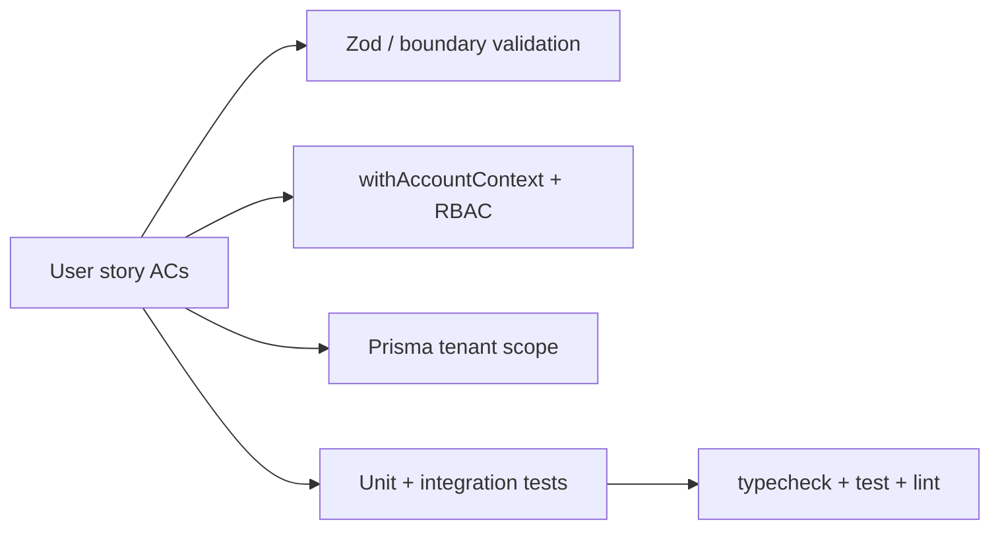

# Capturely — User stories (cursorrule-aligned)

> Last updated: 2026-03-24  
> **Engineering rules:** [cursorrule](../cursorrule) (§0–§12, §13)  
> **Stack & patterns:** [CLAUDE.md](../CLAUDE.md)  
> **What is shipped:** [BUILT-FEATURES.md](./BUILT-FEATURES.md)  
> **Epics 1–4 (intent):** [CAPTURELY-STORIES-E1-E4.md](./CAPTURELY-STORIES-E1-E4.md)

This document defines epics **A–F** with acceptance criteria that explicitly satisfy **cursorrule** (scope, tests, CI, APIs, security, no unintended regressions). When filing tickets (Linear/GitHub), use **cursorrule §10.1** and the issue template under `.github/ISSUE_TEMPLATE/user-story.md`.

---

## How each story should be written

Every story includes **functional** ACs plus **cursorrule** ACs from this matrix:

| cursorrule theme | Acceptance criterion pattern |
| ---------------- | ------------------------------------------------------------------------------------------------------------------------------ |
| Scope (§1) | Implement only what this story requires; remove dead code in touched files. |
| APIs & data (§5) | All inputs validated with Zod (or equivalent); structured `{ error, code }` on failure; response shape unchanged or versioned. |
| Security (§6) | Resource access authorized via `withAccountContext` + RBAC; tests for 403/401 where applicable; no secrets in logs. |
| Tests (§3) | New behavior has unit/integration tests; at least one error/edge path; bugfixes include a regression test. |
| CI (§4) | `npm run typecheck` and `npm test` (and project lint if required) pass; migration included if schema changes. |
| Breaking changes (§0, §4) | Backward-compatible DB changes (expand-first) unless the story explicitly allows a breaking change with migration/runbook. |

Optional **PR checklist** (cursorrule **§9**) as a final “Definition of Done” block for implementers.

---

## Epic A — Documentation hygiene (prerequisite)

### Story A1 — Align engineering rules with Capturely

- **As a** maintainer **I want** `cursorrule` (or `.cursor/rules`) to describe Capturely’s real stack **so that** agents do not follow wrong patterns from obsolete architecture sections.
- **Acceptance criteria**
  - §13 in `cursorrule` describes the **Capturely** stack (from CLAUDE.md): Next.js App Router, Prisma, Clerk, `packages/shared/forms`, widget bundle — not unrelated stacks.
  - Canonical pointers to CLAUDE.md, PRD, and this file are present in `cursorrule`.
  - No functional code change required for A1 beyond rule/doc files.

---

## Epic B — Foundation (built; use as AC templates)

These mirror [BUILT-FEATURES.md](./BUILT-FEATURES.md) Gate A. Use as **templates** for future stories.

### Story B1 — Tenant-scoped API access

- **As a** member of an account **I want** every API to enforce account membership **so that** data never leaks across tenants.
- **Acceptance criteria**
  - Handlers use `withAccountContext()` ([`src/lib/account.ts`](../src/lib/account.ts)); queries include `accountId` (or relation) in `where`.
  - Unauthorized membership returns 403 with structured JSON (not raw stack traces in prod).
  - Tests: happy path + missing/forbidden membership (cursorrule §3, §6).

### Story B2 — RBAC for mutations

- **As an** admin **I want** destructive or sensitive actions restricted by role **so that** members cannot exceed their permissions.
- **Acceptance criteria**
  - Mutations call helpers in [`src/lib/rbac.ts`](../src/lib/rbac.ts) appropriate to the operation.
  - Tests for allowed role and denied role (e.g. member vs owner as specified).

---

## Epic C — Campaigns, builder, publish

### Story C1 — Create and update campaign (API)

- **As a** campaign manager **I want** to create/update campaigns via API **so that** the builder can save state.
- **Acceptance criteria**
  - `POST`/`PATCH` bodies validated with Zod; invalid input returns 400 + `code`.
  - All reads/writes scoped to `accountId`.
  - Tests: success + validation error + forbidden (cursorrule §5, §6).

### Story C2 — Publish campaign (manifest)

- **As a** merchant **I want** publish to update the site manifest **so that** the widget loads the latest config.
- **Acceptance criteria**
  - Publish path idempotent or safe to retry (cursorrule §5, §7 where applicable).
  - Tests or integration checks for manifest write + `hasUnpublishedChanges` (or equivalent) per product spec.
  - No secrets embedded in client-visible manifest.

---

## Epic D — Runtime (widget) and submissions

### Story D1 — Runtime submit with idempotency

- **As a** visitor **I want** retries not to duplicate submissions **so that** I am not double-counted.
- **Acceptance criteria**
  - `UNIQUE(site_id, submission_id)` behavior preserved; documented in story.
  - Tests for duplicate submission id (same logical result, no duplicate row / double charge to usage as defined).
  - No PII in server logs (cursorrule §2, §6).

### Story D2 — Experiment events

- **As a** product owner **I want** impressions/conversions recorded **so that** analytics are accurate.
- **Acceptance criteria**
  - Events tied to `campaignId` / variant per schema; validation at boundary.
  - Tests for invalid payload vs valid (cursorrule §3).

---

## Epic E — Analytics APIs

### Story E1 — Account analytics overview

- **As a** user **I want** aggregated metrics for my account **so that** I can see performance trends.
- **Acceptance criteria**
  - `GET` handler uses `canView`; query params validated (`days`, `sort`, etc. as implemented).
  - Aggregations avoid unbounded N+1 where possible (cursorrule §7); document intentional tradeoffs.
  - Tests: tenant isolation (another account’s data not visible).

### Story E2 — Per-campaign analytics

- **As a** user **I want** per-campaign breakdown **so that** I can compare variants.
- **Acceptance criteria**
  - `campaignId` resolved only if `Campaign.accountId === ctx.accountId`.
  - 404 when campaign missing or wrong account.
  - Tests for 404 and success.

---

## Epic F — Settings and billing (read-heavy)

### Story F1 — Account settings PATCH

- **As an** admin **I want** to update display name, company, timezone **so that** my account profile is correct.
- **Acceptance criteria**
  - [`src/lib/settings.ts`](../src/lib/settings.ts) schema extended only as needed; `PATCH` returns consistent JSON.
  - Migration if new columns; expand-first (cursorrule §0, §4).
  - Tests for validation + forbidden member if mutations are restricted by role.

### Story F2 — Billing status (read)

- **As an** owner **I want** to see plan and usage **so that** I know limits.
- **Acceptance criteria**
  - Stripe (or configured provider) as source of truth for payment state; no full card numbers stored in app DB unless explicitly a product decision already documented.
  - Tests mock billing dependencies; no real Stripe keys in unit tests.

---

## Story → enforcement layers

---

## Deliverable format (per ticket)

Use **cursorrule §10.1** (and `.github/ISSUE_TEMPLATE/user-story.md`):

- **TASK** (one sentence)
- **REQUIREMENTS (Acceptance criteria)** — functional + cursorrule matrix rows above
- **CONSTRAINTS** — No breaking changes; regression tests; CI green
- **CODEBASE CONTEXT** — e.g. `src/app/api/...`, `prisma/schema.prisma`
- **OUTPUT** — Files touched; test commands (`npm run typecheck`, `npm test`)

**Definition of Done:** complete **cursorrule §9** / [`.github/pull_request_template.md`](../.github/pull_request_template.md) on the PR.
