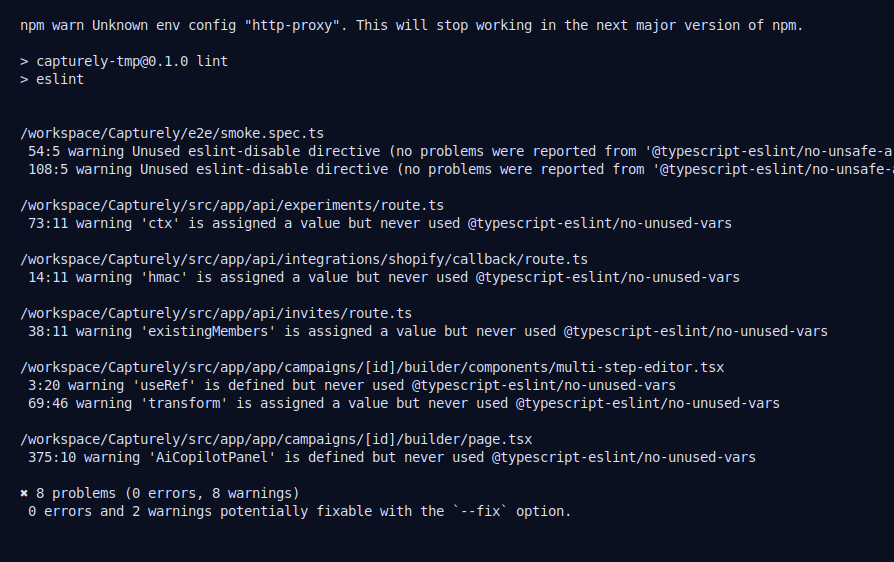
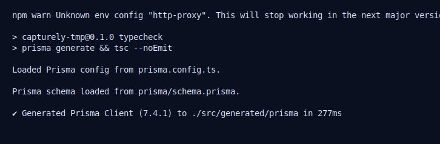
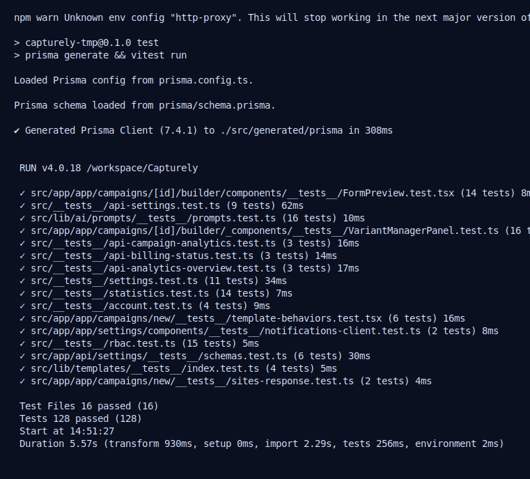
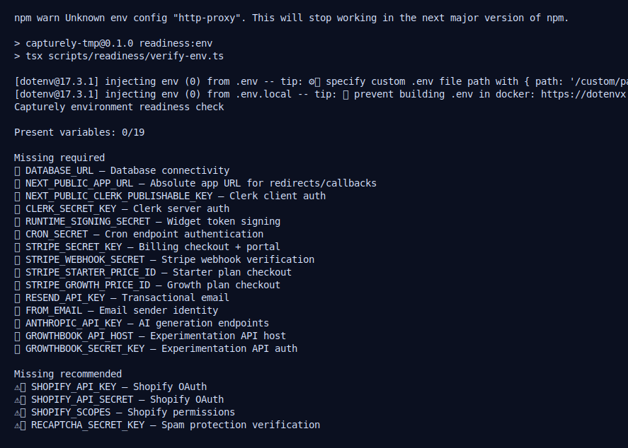
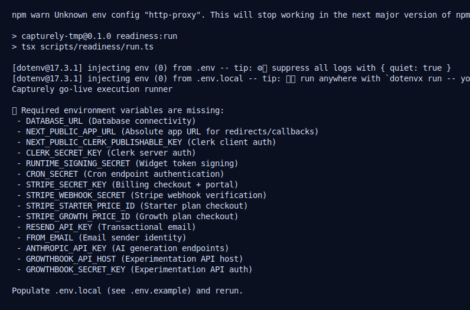
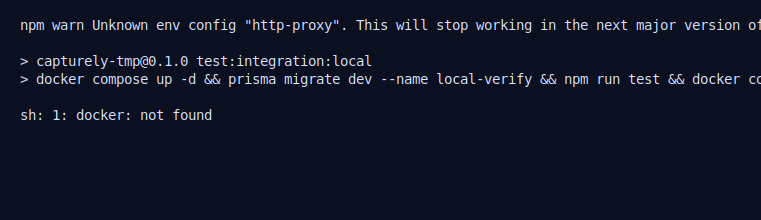

# Capturely Readiness Execution Evidence

**Date:** 2026-04-06  
**Purpose:** Provide execution proof (working vs not working) from actual command runs.

## Evidence Matrix

| Command | Result | Notes |
|---|---|---|
| `npm run lint` | Pass (warnings only) | No eslint errors; warnings remain in existing code. |
| `npm run typecheck` | Pass | Prisma client generation + TypeScript check succeeded. |
| `npm test` | Pass | Vitest suite passed (16 files, 128 tests). |
| `npm run readiness:env` | Fail | Required launch env vars are not configured in this environment. |
| `npm run readiness:run` | Fail | Fails fast due to missing required env vars. |
| `npm run test:integration:local` | Fail | Docker unavailable (`docker: not found`). |

## Screenshots — Working Commands

### 1) `npm run lint`

### 2) `npm run typecheck`

### 3) `npm test`

## Screenshots — Not Working Commands

### 4) `npm run readiness:env` (fails)

### 5) `npm run readiness:run` (fails)

### 6) `npm run test:integration:local` (fails)

## What must be done to reach go-live readiness

1. Populate `.env.local` with required values listed by `npm run readiness:env` (DB, Clerk, runtime signing, cron, Stripe, Resend, Anthropic, GrowthBook).
2. Run in an environment with Docker available for `npm run test:integration:local`.
3. Re-run:
   - `npm run readiness:env`
   - `npm run readiness:run`
4. Require both commands to pass in staging before go-live approval.

## Raw Logs

Raw logs are committed under `docs/evidence/logs/`.
